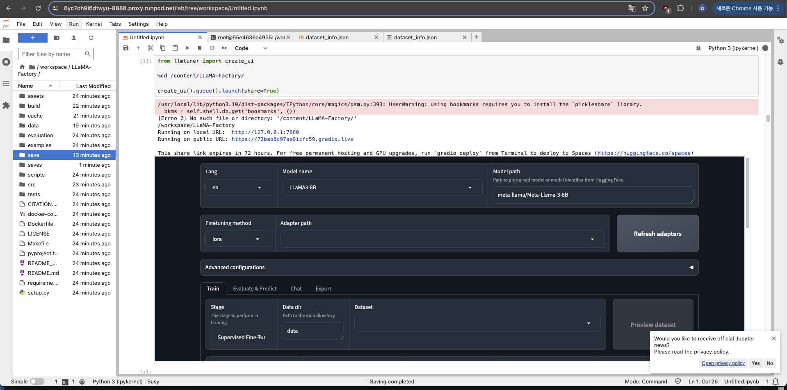

# SLLM
주피터 노트북 기준으로 실행

## 라마팩토리 실행코드

```yaml
!git clone https://github.com/hiyouga/LLaMA-Factory.git
%cd LLaMA-Factory
%ls
!pip install "unsloth[colab-new] @ git+https://github.com/unslothai/unsloth.git"
!pip install --no-deps xformers
!pip install .[bitsandbytes]
```

```yaml
#이거 없어도 됨 코랩 예제임
import json
 
%cd /content/LLaMA-Factory/
 
NAME = "Llama-3"
AUTHOR = "LLaMA Factory"
 
with open("data/identity.json", "r", encoding="utf-8") as f:
  dataset = json.load(f)
 
for sample in dataset:
  sample["output"] = sample["output"].replace("NAME", NAME).replace("AUTHOR", AUTHOR)
 
with open("data/identity.json", "w", encoding="utf-8") as f:
  json.dump(dataset, f, indent=2, ensure_ascii=False)
```

```yaml
# 실행 
from llmtuner import create_ui
 
%cd /content/LLaMA-Factory/
 
create_ui().queue().launch(share=True)

# or bash 실행

# export CUDA_VISIBLE_DEVICES=0 # `set CUDA_VISIBLE_DEVICES=0` for Windows
# export GRADIO_SERVER_PORT=7860 # `set GRADIO_SERVER_PORT=7860` for Windows
# python src/train_web.py # or python -m llmtuner.webui.interface
```

실행된 모습




다른 모델을 다운 받을 때 계약서? 같은 걸 작성해야 다운받을 수 있는 모델이 있는데 

허깅페이스에서 해당 모델 동의하고 토큰을 발급받아 로그인하면 불러올 수 있음


```yaml
huggingface-cli login
- 토큰 입력
```

### 데이터셋 추가하는 방법

1. data 폴더에 자신의 데이터 셋을 추가한다.


1. dataset_info.json에 추가한 파일명과 , shasum {파일명} 을 사용하여 sha1를 입력한다
    
    ```yaml
      "output": {
        "file_name": "output.json",
        "file_sha1": "404f3688eec3c2ef887a81dfe9e3357287132dd5"
      },
    ```
    


### ORPO나 DPO 사용

자신의 데이터셋에서 output에 한줄을 더 추가한다

리워드 모델처럼 좋은답변, 부정답변 예시를 데이터 셋 자체에 추가하는 과정

(해당 학습 방법은 RM이 없고 데이터 셋으로 대체됨)

```yaml
[
  {
    "instruction": "What are the three primary colors?",
    "input": "",
    "output": [
      "The three primary colors are red, blue, and yellow. These colors are called primary because they cannot be created by mixing other colors and all other colors can be made by combining them in various proportions. In the additive color system, used for light, the primary colors are red, green, and blue (RGB).", #좋은 답변
      "Red, Yellow, and Green." # 나쁜 답변
    ]
  },
]
```

### deepspeed 사용하는 방법

```yaml
#딥 스피드 설치
pip install -U deepspeed 
```

```yaml
먼저 트레이닝 돌릴 설정을 다 하고 Preview command를 눌러 옵션값 출력
출력된 옵션값을 기반으로
examples/lora_multi_gpu/ds_zero3.sh 에 있는 코드를 참고하여 커맨드 수정
```


주피터 환경이고 4000번대를 활용한다면 아래 환경변수를 설정하거나 accelerate 커맨드로 deepspeed 대체

```yaml
import os
os.environ['NCCL_P2P_DISABLE'] = '1' 
os.environ['NCCL_IB_DISABLE'] = '1'
```

```yaml
!deepspeed --num_gpus=2 src/train_bash.py \
    --deepspeed examples/deepspeed/ds_z3_config.json \
    --stage sft \
    --do_train True \
    --model_name_or_path meta-llama/Meta-Llama-3-8B \
    --finetuning_type lora \
    --template default \
    --flash_attn auto \
    --dataset_dir data \
    --dataset output \
    --cutoff_len 1024 \
    --learning_rate 5e-05 \
    --num_train_epochs 3.0 \
    --max_samples 100000 \
    --per_device_train_batch_size 2 \
    --gradient_accumulation_steps 8 \
    --lr_scheduler_type cosine \
    --max_grad_norm 1.0 \
    --logging_steps 5 \
    --save_steps 100 \
    --warmup_steps 0 \
    --optim adamw_torch \
    --report_to none \
    --output_dir saves/LLaMA3-8B/lora/train_2024-04-26-07-18-08 \
    --fp16 True \
    --lora_rank 8 \
    --lora_alpha 16 \
    --lora_dropout 0 \
    --lora_target q_proj,v_proj \
    --plot_loss True 
```


GPU 2개를 전부 사용하는 것을 확인할 수 있다.


~~아니 근데 547.kb를 llama3에 학습하는데 1시간 30분 걸림;;~~


---

## text generation webui 실행 코드

conda환경에서 실행하려면 원클릭 파일 실행으로 설치, 시작 가능

```yaml
git clone https://github.com/oobabooga/text-generation-webui

./start_linux.sh
```

일반 환경에서 시작하는 방법

```yaml
 # 깃 레포 클론
!git clone https://github.com/oobabooga/text-generation-webui
 
%cd text-generation-webui
 
!pip install peft gradio
 
!pip install -r requirements.txt
 
!pip install numba datasets accelerate
 
!pip install -U deepspeed
 
!pip install -i https://pypi.org/simple/ bitsandbytes
```

```yaml
#우바부가 실행, 챗모드로 실행
!python server.py --chat --share --listen 
```# SLLM
